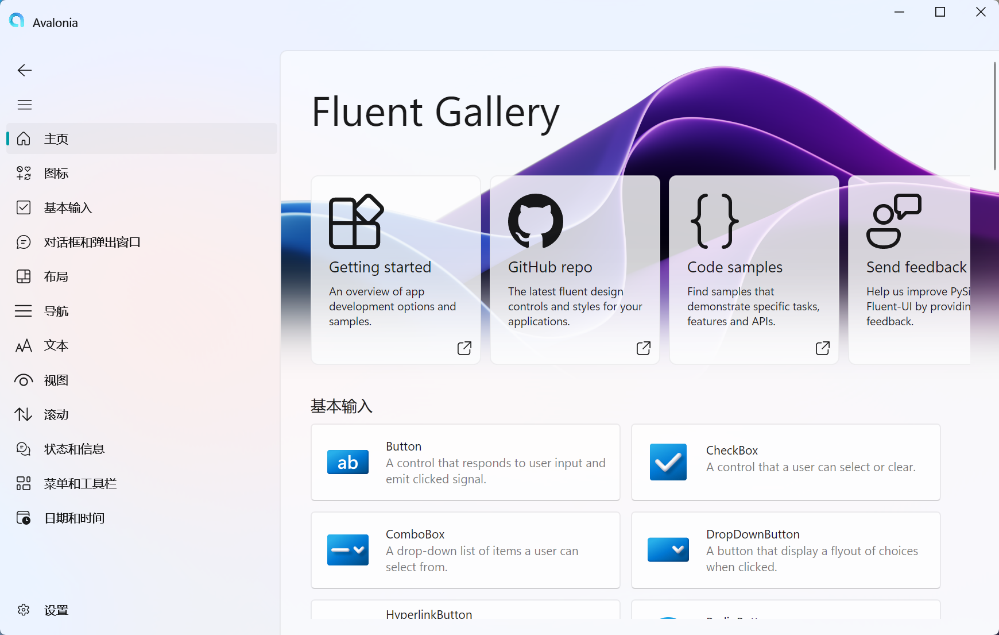

<p align="center">
</p>
  <h1 align="center">
  Avalonia-Fluent-UI
</h1>
<p align="center">
适用于Avalonia应用的现代流畅设计UI, 在<a href="https://github.com/amwx/FluentAvalonia.git">FluentAvalonia</a>的基础上修改的,增加了一些控件
</p>

<div align="center">

[](LICENSE)
[](https://avaloniaui.net/)
[](https://www.nuget.org/packages/AvaloniaFluentUI/)
</div>



## 安装🚀
```shell
dotnet add package AvaloniaFluentUI
```

## 运行示例▶️
克隆仓库后就可以运行 samples 目录下的示例程序, 也可以通过[Release](https://github.com/HiyorinI/AvaloniaFluentUI/releases)页面下载
```shell
cd samples/Gallery.Desktop
dotnet run -c Release
```

## 许可证📄
#### AvaloniaFluentUI 使用 [MIT](LICENSE) 许可证授权非商用项目。

特此授予任何人免费获得本软件及相关文档文件（以下简称“软件”）的许可，允许其不受限制地处理本软件，包括但不限于使用、复制、修改、合并、发布、分发、再许可和/或出售本软件的副本，并允许向其提供本软件的人员这样做，但须遵守以下条件：

上述版权声明和本许可声明应包含在软件的所有副本或实质性部分中。

本软件按“原样”提供，不提供任何形式的明示或暗示的保证，包括但不限于适销性、特定用途适用性和不侵权保证。在任何情况下，作者或版权所有者均不对任何索赔、损害或其他责任承担责任，无论该责任是因合同、侵权或其他原因引起的，也无论该责任是因本软件或其使用或交易而引起的。
