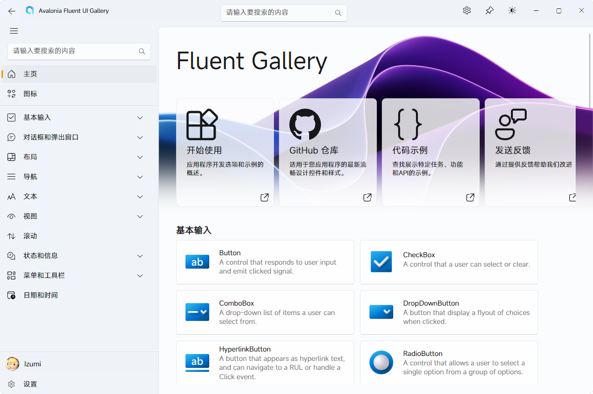

<p align="center">
</p>
  <h1 align="center">
  Avalonia-Fluent-UI
</h1>
<p align="center">
A modern, smooth design UI for Avalonia applications, modified based on <a href="https://github.com/amwx/FluentAvalonia.git">FluentAvalonia</a>, with some added controls
</p>

<div align="center">

[](LICENSE)
[](https://avaloniaui.net/)
[](https://www.nuget.org/packages/AvaloniaFluentUI/)
</div>

<p align="center">
English | <a href="README_zh_CN.md">简体中文</a>
</p>



> [!Note]
> 
> If you want to use the latest features, please clone this repository and build

## Install🚀
```shell
dotnet add package AvaloniaFluentUI --version 2.0.3
```

> [!Warning]
> 
> The current library is Avalonia12 version
> 
> If you need to use Avalonia 11, switch to the [Avalonia-11.3.12](https://github.com/IzumiPL/Avalonia-Fluent-UI/tree/avalonia-11.3.12) branch

## Run the example▶️
After cloning the repository, you can run the sample program in the samples directory, which can also be downloaded from the [Release](https://github.com/IzumiPL/Avalonia-Fluent-UI/releases) page

```shell
cd samples/Gallery.Desktop
dotnet run -c Release
```
## Document
Want to learn more about Avalonia-Fluent-UI? Please read the following. [Help Document](https://docs.mikuas.top)👈

## License📄
#### AvaloniaFluentUI uses the [MIT](LICENSE) license to authorize non-commercial projects.

Permission is hereby granted, free of charge, to any person obtaining a copy of this software and associated documentation files (the "Software"), to deal in the Software without restriction, including without limitation the rights to use, copy, modify, merge, publish, distribute, sublicense, and/or sell copies of the Software, and to permit persons to whom the Software is furnished to do so, subject to the following conditions:

The above copyright notice and this permission notice shall be included in all copies or substantial portions of the Software.

THE SOFTWARE IS PROVIDED "AS IS", WITHOUT WARRANTY OF ANY KIND, EXPRESS OR IMPLIED, INCLUDING BUT NOT LIMITED TO THE WARRANTIES OF MERCHANTABILITY, FITNESS FOR A PARTICULAR PURPOSE AND NONINFRINGEMENT. IN NO EVENT SHALL THE AUTHORS OR COPYRIGHT HOLDERS BE LIABLE FOR ANY CLAIM, DAMAGES OR OTHER LIABILITY, WHETHER IN AN ACTION OF CONTRACT, TORT OR OTHERWISE, ARISING FROM, OUT OF OR IN CONNECTION WITH THE SOFTWARE OR THE USE OR OTHER DEALINGS IN THE SOFTWARE.
